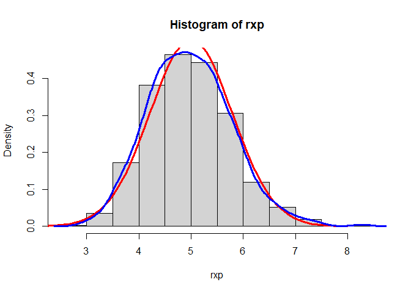

# Exponential Distribution 
Generate 40 random variables and take the mean using rexp()as well (lamda = 0.2, n = 40)
Then, store the mean in "rxp" and repete it 1,000 times
Finally make histogram of the mns


```r
rxp <- NULL; lamda <- 0.2
for (i in 1:1000) rxp <- c(rxp, mean(rexp(40, lamda)))
hist(rxp)
```

<!-- -->

# 1.Show the sample mean and compare it to the theoretical mean of the distribution.


```r
print(c("sample mean", mean(rxp))); print(c("theoretical mean", 1/lamda)) 
```

```
## [1] "sample mean"      "4.97967534468169"
```

```
## [1] "theoretical mean" "5"
```
check 95% confidence interval with t.test() and make sure there is no statistical significant between the two means


```r
t.test(rxp)
```

```
## 
## 	One Sample t-test
## 
## data:  rxp
## t = 197.03, df = 999, p-value < 2.2e-16
## alternative hypothesis: true mean is not equal to 0
## 95 percent confidence interval:
##  4.930080 5.029271
## sample estimates:
## mean of x 
##  4.979675
```


# 2.Show how variable the sample is(via variance) and compare it to the theoretical variance of the distrubution.
the variance of the distribution is μ^2/n, thus the sample variance and theoretical variance are

```r
print(c("sample variance", var(rxp)))
```

```
## [1] "sample variance"   "0.638763771197883"
```

```r
theova <- ((1/lamda)^2)/40
print(c("theoretical variance", ((1/lamda)^2)/40))
```

```
## [1] "theoretical variance" "0.625"
```

# 3.Show that the distribution is approximately normal


```r
hist(rxp, freq = FALSE)
curve(dnorm(x,mean = 1/lamda, sd = (lamda*sqrt(40))^-1),add = TRUE,from = 2, to = 8, col = "red", lwd = 3)
lines(density(rxp), col = "blue", lwd = 3)
```

<!-- -->

