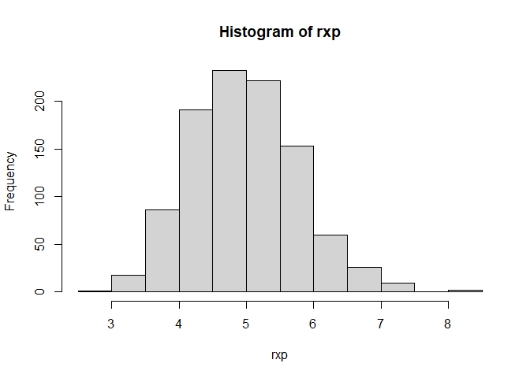

# Exponential Distribution 
Generate 40 random variables and take the mean using rexp()as well (lamda = 0.2, n = 40)
Then, store the mean in "rxp" and repete it 1,000 times
Finally make hitogram of the mns


<!-- -->

# 1.Show the sample mean and compare it to the theoretical mean of the distribution.


```
## [1] "sample mean"      "4.99991076580638"
```

```
## [1] "theoretical mean" "5"
```
check 95% confidence interval with t.test() and make sure there is no statistical significant between the two means


```
## 
## 	One Sample t-test
## 
## data:  rxp
## t = 199.15, df = 999, p-value < 2.2e-16
## alternative hypothesis: true mean is not equal to 0
## 95 percent confidence interval:
##  4.950645 5.049177
## sample estimates:
## mean of x 
##  4.999911
```


# 2.Show how variable the sample is(via variance) and compare it to the theoretical variance of the distrubution.
the variance of the distribution is μ^2/n, thus the sample variance and theoretical variance are

```
## [1] "sample variance"   "0.630303877889683"
```

```
## [1] "theoretical variance" "0.625"
```

# 3.Show that the distribution is approximately normal


